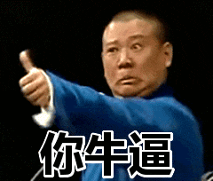

# 关于「Web3 项目运营」的一些看法和心得，“偷感重”很关键～

做Web3项目，许多人把重点放在技术创新和代码架构上，但在众多项目的成败中，我看到一个残酷的真相：**技术并不是决定项目成败的关键因素。****当用户在30秒内决定是否参与你的项目时，他们想知道的不是你的共识算法有多先进，而是"这个项目能给我带来什么？"**本文将揭示我在亲身参与多个Web3项目后总结的成功法则 - 不是关于技术的，而是关于人性的。

------

**项目本质：你是谁，这很重要**

现实很残酷，大多数人根本不会仔细阅读你的项目介绍。就像你不会详细研读苹果手机说明书一样，用户也不会认真研究你的白皮书或技术文档。**这其实很现实，做web3项目或者其他任何的2C的项目都要接受一个残酷的现象，就是用户只会给你30秒注意力，你要是无法吸引住他们的注意力，那就没有继续了。。。**

在这短暂时间里，你必须让人记住两点：

**1. 你很牛逼**

**2. 我能通过你的牛逼，自己捞点钱**

因此设计信息时，考虑**"如果用户只记住一句话，那应该是什么"**，然后在各种渠道反复强调这句话，而不是试图传达完整的项目细节。**这句话不要太多有废话，不要太多炫技的介绍，就啪啪啪罗列牛逼的词汇，**比如下面的介绍：

*“币安投资、颠覆英伟达的超小参数大模型、第一个链上的大模型项目、白名单开放中”*

你看看我这介绍，你还关系什么项目吗？？？你是不是看起来第一句话就问，这咋参与！！即使，我这里有个明显四不像的描述——颠**覆英伟达的超小参数大模型，英伟达是算力的有个屁模型啊。。但是重要吗？？不重要！！**因为这个介绍到了大部分人的耳朵里的知识图谱就是：

- **英伟达：我知道，很牛逼的公司，超厉害，股票万亿美元**
- **大模型：牛逼，现在最火的题材和趋势，一定厉害**
- **超小参数：牛逼的词，我不知道是啥**

**连起来对于“颠覆英伟达的超小参数大模型”的理解就是，“卧槽，一个超级牛逼的、最先进技术的公司我知道啊，现在有一个更牛逼的公司把它颠覆了！”。。**仅此而已，不需要任何实际的技术名词存在，这句话本身也成立的，而这你别不信，对于大部分人最终收到的信息就是这个！

技术当然重要，但除非你是做底层公链或基础设施的项目，否则技术只是基本条件，不是核心卖点。用户更关心的是收益和体验。**一位成功创始人告诉我："大家想听的不是你怎么造了一辆车，而是这辆车能带他们去哪里。"**

当然这会导致一个有意思的现象：同一个项目在不同人心中会有完全不同的理解。有人认为你是DeFi项目，有人觉得你是NFT平台，还有人以为你是GameFi。但是！**不要试图纠正每个人的理解**。只要他们的认知中，你的项目是有价值的，就足够了。

------

**用户分层与精准策略**

根据我的经验，其实不仅仅是Web3，大部分2C的应用，用户大致可分为三类，每类需要不同的策略：

- **资金实力强的决策者（鲸鱼）**：他们更关注长期价值和投资回报，最怕错过潜在的大机会。因此如果是小规模投入可以有大的潜在收益，他们出手往往很快。重点强调稀缺性和早期优势，如"早期投资者专属权益，限额50个席位"！

- **社区活跃的参与者（气氛组）**：热衷于互动但投入有限，或者根本不会投入，他们的作用就是给你贡献大量数据的气氛组，当然他们也很重要！他们可能不会大量投资，但会成为品牌传播者。**对于他们就让他们去“撸毛”，设计简单但有成就感的参与机制，任务系统、积分奖励和社区荣誉。让他们获得小部分收益。实际上你让位给他们的收益远远低于你找专业团队刷数据。**

- **犹豫不决的观望者（潜在用户）**：这部分在大部分项目中都是占大多数，有兴趣但需要额外推动。**对于他们的策略是渐进式转化，不要着急，遵循路径，低门槛体验→社交证明→创造紧迫感。**他们看着看着自然就会付费。

记住，用户不是被说服的，而是被"PUA"的。你需要给出的不是确定答案，而是一个能让他们详细未来潜力和超额回报的模糊回答。

------

**保持热度，赌徒心理学**

项目最怕的不是被批评，而是被遗忘。热度就是一切，一旦冷却就很难重新点燃。你要和用户交朋友，很多用户其实是很渴望和项目方交流获得重视的，因为大部分项目方不会鸟他们，而一旦这些意见领袖得到了重视，他们就会在社区内创造一个很好的氛围。所以真诚也蛮重要。

Web3的用户就是一群赌徒，**你的项目本身的功能和技术不重要，重要的是创造"不来可能会错过什么"的心理。**这就是赌徒心理学的应用：

- **随机奖励机制：**设计不可预测的奖励系统，不确定性会刺激多巴胺分泌，让用户反复回访。例如："每日登录有1%概率获得稀有NFT"。
- **累积概率：**让用户感觉"坚持越久，获得大奖几率越大"。例如：连续签到30天的用户获得大奖概率是1天的10倍
- **限时机会：**创造"今天不参与就永远错过"的感觉，例如：限量铸造、一次性活动
- **近似成功体验：**让用户体验"差一点就成功"的感觉，例如：抽奖转盘停在大奖旁边，刺激用户再次尝试

某游戏项目每天只有三次领取空投的机会，且每次有小概率获得价值不菲的道具。据了解，这个设计使得日活跃度保持在惊人的85%，远高于功能类似但无此机制的竞品。

**另外犹抱琵琶半遮面很重要，不要露你的底牌，也不要给用户太多信息保持神秘就很重要。**不用管用户说啥，他们更看重你能带来啥，抓住核心本质。。比如我做项目的时候，我就不发布白皮书，很多人在社区里面问，质疑，那就质疑好啦。。。你如果某公链官方关照我，你还是会乖乖来我这里做任务。所以你要搞明白本质，你只要能带他们赚钱，其他的都是小事儿。**就和电视剧里面霍去病说过的一句话“将军不一定要和士兵同甘共苦，只要赢就好”。不要错把过程的细节过度看重，一切以核心结果为出发点。**

------

**KOL策略：让他们主动为你代言**

获得KOL支持是关键一步，但高质量KOL往往收费不菲。如何让他们免费为你宣传我觉得这是核心。你要实现反向拿捏他们，你就要知道他们的诉求是什么，大部分KOL的核心需求：

- **经济收益**
- **个人形象提升**

设计能满足这两点的机制，KOL自然会主动宣传你的项目。

' fill='%23FFFFFF'%3E%3Crect x='249' y='126' width='1' height='1'%3E%3C/rect%3E%3C/g%3E%3C/g%3E%3C/svg%3E)

**比如长期收益模式**：推荐返佣机制，KOL推荐的用户每产生交易，KOL就能获得一定比例的持续收入。这比一次性付费宣传效果好得多。

**比如稀缺性身份标识**：为KOL创建特殊身份，如"创世顾问NFT"，限量发行，持有者可参与重大决策。这些KOL为了彰显自己的行业地位，会主动展示这一身份。

**最重要的一点是营造一个紧迫感的气氛，当一个项目有足够多的KOL在谈论，后来的KOL会出于"害怕错过"的心理自发加入讨论。**这就是你需要创造的连锁反应，也是让KOL主动给你代言的基础。要么有钱，要么有其他的收益，哪怕是流量的收益。

------

**跨界合作，借力打力的艺术**

在Web3领域，partenership真的是一个很好的文化，找到合适的合作伙伴可能比单打独斗重要得多。战略合作本质上是一场"借势"游戏，双方互相利用对方的社区和资源扩大自身影响力。

' fill='%23FFFFFF'%3E%3Crect x='249' y='126' width='1' height='1'%3E%3C/rect%3E%3C/g%3E%3C/g%3E%3C/svg%3E)

最宝贵的资源不是资金，而是活跃用户。通过与其他项目合作，你能接触到全新的用户群体，同时也提高了知名度，而且这些用户已经对Web3有基本认知，转化成本远低于从零开始教育的普通用户。**你和谁玩，大家就觉得你是谁？当你每天都和一群很不错的项目玩，你的形象自然高达；但是当没啥人和你partenrship的时候，大家也自然觉得你就这样了。**

**合作方式多样化**：

- **联合活动：AMA、社区问答、线上活动等**
- **交叉空投：针对对方社区成员定向空投代币**
- **功能集成：互相集成对方的功能**
- **联名产品：共同推出限量版产品或功能**

理想的合作伙伴不一定是最大的项目，而是用户群体与你有重叠但又不完全相同的项目。这样能最大化新用户获取效率。

------

**流量都是蹭出来的，“偷感要重”**

在Web3领域，蹭热点是基本技能，但要有技巧**：暗示而非声明，关联而非攀附。**

当市场出现热点事件，如比特币减半或以太坊升级，可以借势提升自身曝光度。关键在于保持"策略性模糊"：暗示可能的关联，但不做过度承诺。

' fill='%23FFFFFF'%3E%3Crect x='249' y='126' width='1' height='1'%3E%3C/rect%3E%3C/g%3E%3C/g%3E%3C/svg%3E)

例如，可以发布"我们正密切关注ETH 2.0升级，这对我们的生态有重要启示"这类声明。这既建立了与热门项目的联系，又不会因为过度承诺而被质疑。**再比如deepseek出了新模型，你就可以出一个partnership的海报，宣布你适配了deepseek模型。。大部分其实都不知道deepseek模型合作的意义，以为你们官方，其实你就是做了个本地化部署而已。。**

蹭热点的高级玩法是围绕热点创建独特叙事。某DeFi项目在比特币减半期间推出了"减半庆典活动"，虽然项目本身与比特币减半没有直接关系，但成功吸引了大量关注比特币的用户。

' fill='%23FFFFFF'%3E%3Crect x='249' y='126' width='1' height='1'%3E%3C/rect%3E%3C/g%3E%3C/g%3E%3C/svg%3E)

另外，外在大流量的支持很重要，很多时候一个大的kol或者官方公链给你的一个转推会带来意想不到的收获。（**因为用户会觉得你和官方公链做老鼠仓，跟着你们可以一起分赃）****哈哈，所以大家有时候追求的不是公平，而是自己不能享受到特权。当你向他暗示你可能成为特权分子的一员的时候，你看他还会关注公平吗？恨不得不让其他人知道消息**。。**这种“偷感”在web3其实蛮关键。**

------

**一些经常使用的运营策略**

Web3领域有许多独特的运营工具，巧妙运用这些机制可以事半功倍：

' fill='%23FFFFFF'%3E%3Crect x='249' y='126' width='1' height='1'%3E%3C/rect%3E%3C/g%3E%3C/g%3E%3C/svg%3E)

- **联合质押（Co-staking）：**用户同时质押你和合作项目的代币获得额外奖励，增加代币锁定量，创造项目间联系。建议：设计递减的奖励机制，前期吸引注意，后期稳定长期价值
- **互相挖矿（Cross-mining）：**用A项目代币挖B项目代币，反之亦然；创造两个社区之间的用户流动。
- **社区白名单（Community Allowlist）：**为合作项目社区成员预留专属参与名额，最简单但效果显著的引流方式。
- **推特活动（Twitter Engagement）：**"转发+关注+标记朋友"的活动，通过社交媒体实现几何级传播。技巧：奖品设置"一个大奖+多个小奖"，活动周期控制在3-7天。比如可以做的就是为了庆祝TGE，作为合作伙伴的下面的群众都可以有代币，这样你就给其他社区福利来，其他社区也好给你转发。
- **零撸活动（Freebie Campaigns）：**设计简单任务让用户免费获得小额代币；类似拼多多模式，降低首次参与门槛。例如："每日签到送1枚代币"
- **双代币模型（Dual Token System）：**分离治理代币和功能代币。平衡投资价值和实用功能。
- **多链部署（Multi-chain Strategy）：**在多个区块链同时部署产品，扩大用户基础并分散风险。建议：先在一个主链完善产品，再逐步扩展
- **概念NFT（Concept NFT）：**产品正式上线前，先发行概念NFT作为未来权益凭证，提前积累社区和资金。

**
**

**典型经典案例：白名单空投获取知名社区用户**

' fill='%23FFFFFF'%3E%3Crect x='249' y='126' width='1' height='1'%3E%3C/rect%3E%3C/g%3E%3C/g%3E%3C/svg%3E)空投是Web3营销的独特武器，设计得当可以产生惊人效果。一个完整的空投策略包括：

- **第一步：借势大项目。**宣布向持有Pi币的地址空投代币。因为PI币的人群基数大，这样蹭热度并精准触达加密货币用户群体。而且你白送没人要，但是你设置了必须持有xx代币这个门槛，大家就觉得会有价值。
- **第二步：制造稀缺感。**设置申领时间限制，如"仅限48小时内申领"，紧迫感促使用户立即行动
- **第三步：锁仓释放机制。**告知总数量，但每天只可以通过固定任务释放一小部分，其余分期解锁，减少抛售意愿。可以长期稳定价格。甚至可以更进一步设置一些规则，比如每天如果没有可以释放的额度（额度需要通过完成任务获取），该部分代币就要被别人分走了来吸引用户交互。毕竟到你口袋里被拿走的和本来没有是两回事，在这里你也可以配合下面的推荐机制。
- **第四步：推荐增益。**设计推荐奖励机制，如"每推荐一人，双方各获500枚代币"。同时也可以和上一步互动，推荐解锁部分额度，然后交易。
- **第五步：制造财富效应。**上dex，因为释放量有限，实际你的成本是可控的。通过做市让部分早期用户获得显著收益，通过各种渠道放大这些成功案例，这样会形成新的一波宣传效应。

------

**关于社区治理**

社区是项目的生命线，而社区问题处理不当可能导致项目崩盘。记住以下原则：

- **防止破窗效应：**社区中的负面声音如同破窗，不及时修复会导致更多破窗；迅速回应是关键，即使只是临时回应也比沉默好。
- **改错不认错，转移注意力：**避免长篇大论的道歉和解释原因，直接展示解决方案。同时，推出新活动或功能来转移用户注意力**
	**
- **奖励积极贡献：分化对手，对**明确表彰对社区有建设性贡献的成员。建立榜样效应，引导其他成员行为。就像毛主席说的，要把朋友搞得多多的，把敌人搞得少少点。。
- **一个字就是“干”：**说实话，要是实在解释不了，或者一帮人天天搞负面情绪，物理清除会更好。

' fill='%23FFFFFF'%3E%3Crect x='249' y='126' width='1' height='1'%3E%3C/rect%3E%3C/g%3E%3C/g%3E%3C/svg%3E)

------

**总结**

成功的Web3项目建立在对人性的深刻理解上。技术是基础，但营销策略、社区建设和用户心理把握才是决定成败的关键。

记住两个核心问题：

1. 为什么用户应该相信你？
2. 用户能从中获得什么？

通过精心设计的机制和策略，让用户自然而然地回答这两个问题，你的项目就站在了成功的起点上。在**Web3世界，讲好故事的能力往往比精湛的技术更能决定项目命运。用户投资的不仅是你的产品，更是你描绘的未来图景。**

当然我这里说的不是技术不重要，而是再说，再好的技术，如果没有足够的营销加持，是无法取得根本性的成功的。

------

